# Silver Point Restaurant - Restaurant Management System

<a href="https://github.com/comp-bkt/component-2-sandesh123paudel/tree/master">**VLE Repo**</a>
<a href="https://github.com/tbc-bsc-l6/component-2-sandesh123paudel">**The British College Repo**</a>

## Overview

Welcome to the Silver Point Restaurant project, an advanced web engineering assignment developed by Sandesh Paudel for Level 6 at The British College. This project serves as a comprehensive Restaurant Management System.

## Project Details

- **Module:** Advanced Web Engineering(AWE)

- **Student Name:** Sandesh Paudel
- **Level:** 6
- **Student ID:** 77297958
- **Module Tutor:** Pratik Shrestha

## About Project

The Silver Point Restaurant project is designed to streamline restaurant management operations. It includes features such as:

- Authorization and  Authentication
- Searching, Sorting and Filtering Data
- Pagination
- Add to Cart, Checkout and Creation of Order
- Multiple Payment Mode
- Complete CRUD including Images
- Email Verification and Forget-Password

## Getting Started

To run the project locally, follow these steps:

1. **Install Composer**
    - Install the composer from the official site following the instruction there. [Composer Installation](https://getcomposer.org/download/)
2. **Install Laravel Via Composer**
    - "composer create-project --prefer-dist laravel/laravel silver-point-restaurant"
3. **Navigate to Project Directory**
    - "cd silver-point-restaurant"
4. **Clone the Repository**
    - "git clone https://github.com/comp-bkt/component-2-sandesh123paudel.git"
    or
    - "git clone https://github.com/tbc-bsc-l6/component-2-sandesh123paudel.git"  
5. **Install Dependencies**
    - "composer install"
6. **Configure Environment Variables**
    - Create and copy of the '.env.example' file (cp .env.example.env)
    - Open .env and configure the database and other environment variables
7. **Generate Application Key**
    - "php artisan key:generate"
8. **Run the Database Migrations and Seeders**
    - php artisan migrate --seed
9. **Start the Development Server**
    - "php artisan serve"
10. **Access the Application**
    - Visit "http://127.0.0.1:8000/" in your browser to access Silver Point Restaurant Application

## Project OverView

**HomePage**
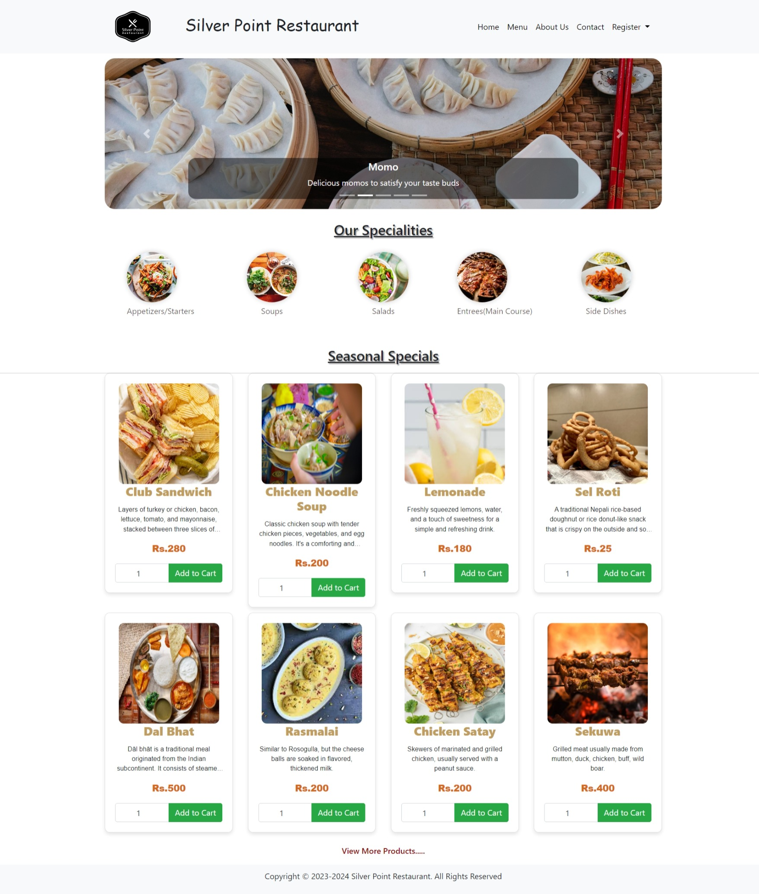

**MenuPage**
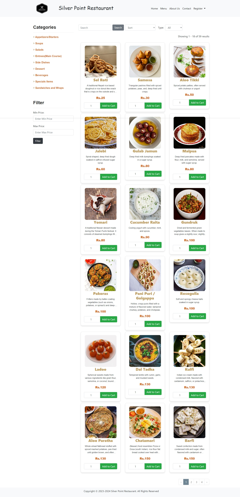

**About**
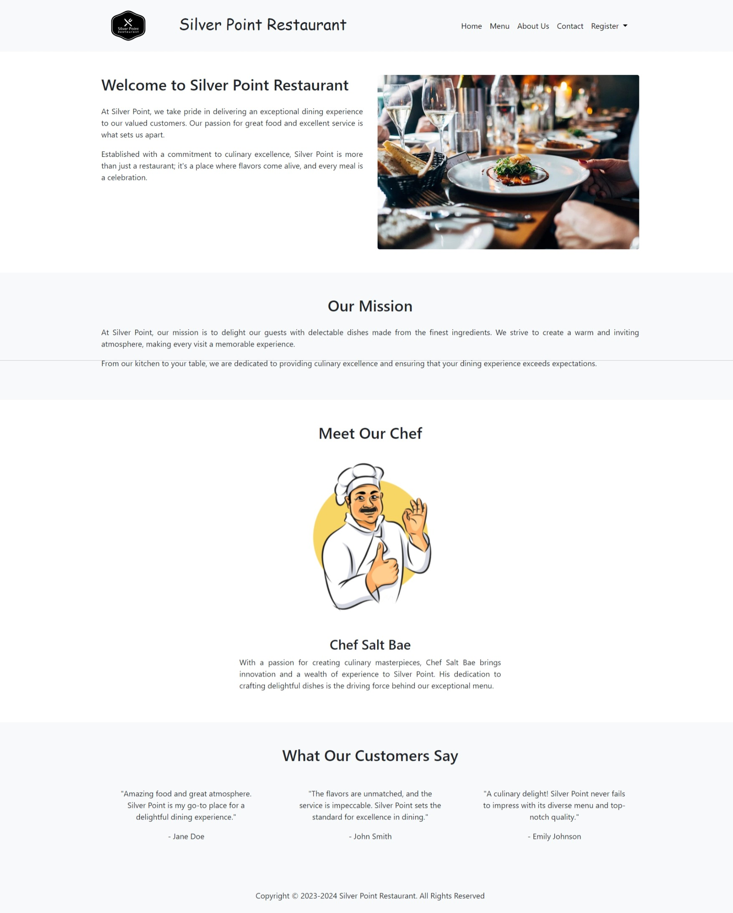

**Contact Us**
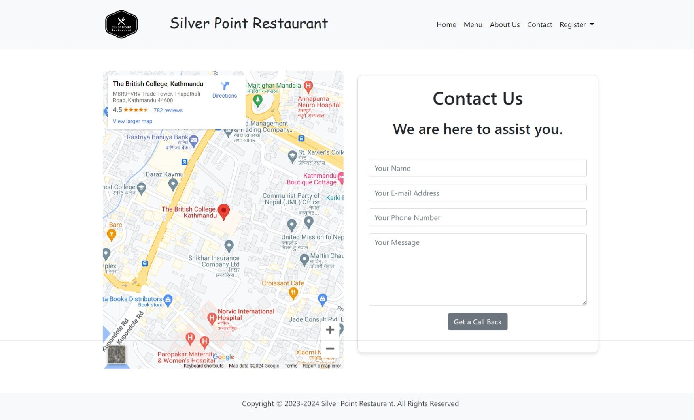

**Login In**
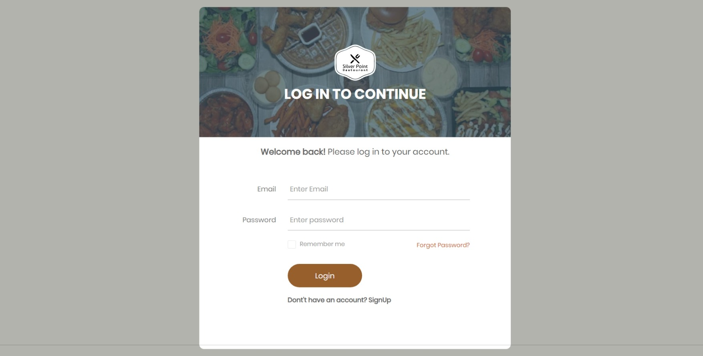

**Sign Up**
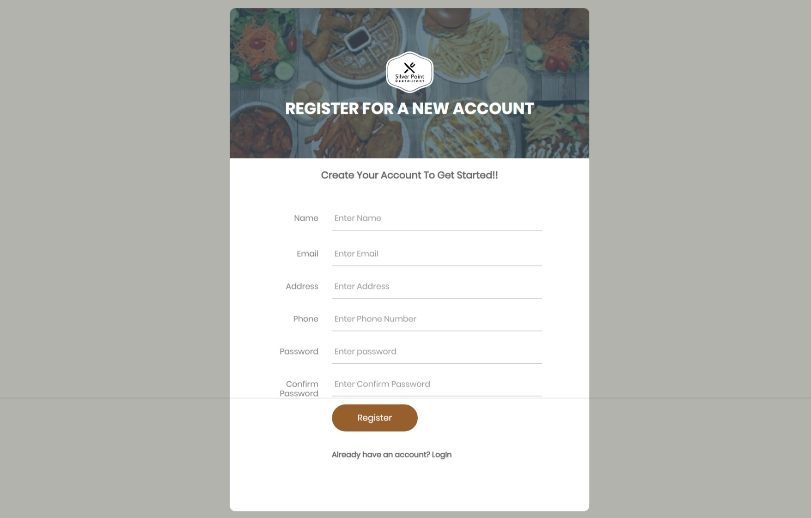

**Forget Password**
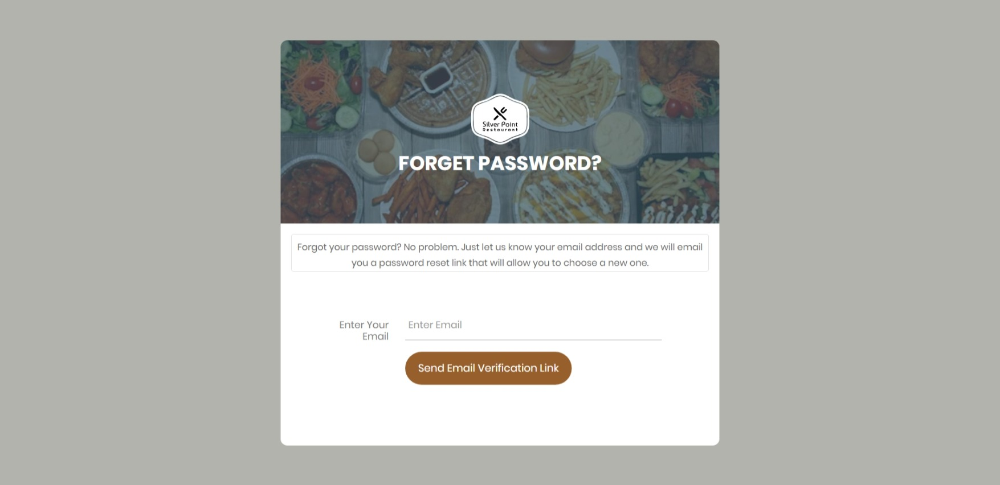

**User Dashboard**
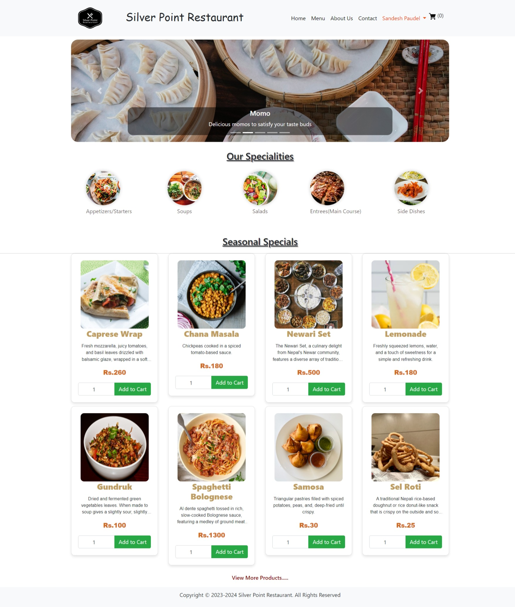

**Cart-Page**
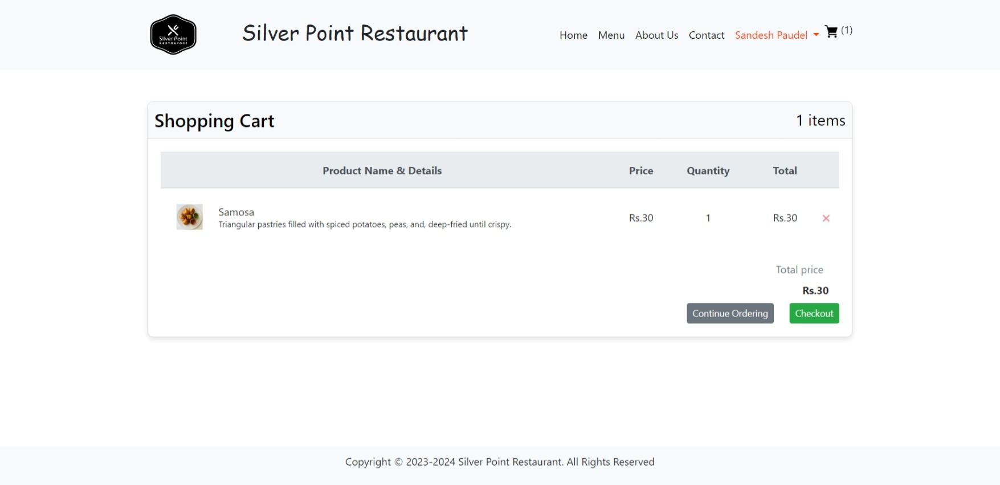

**CheckOut-Page**
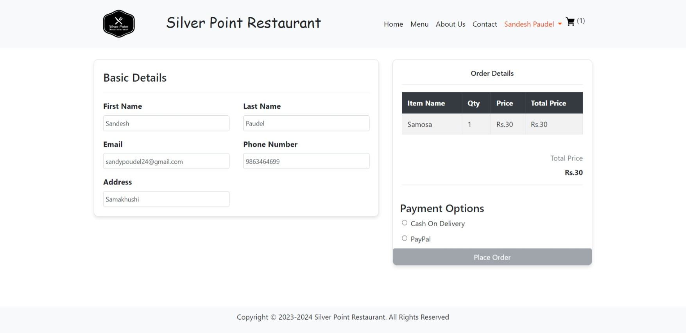

**Order-Info**
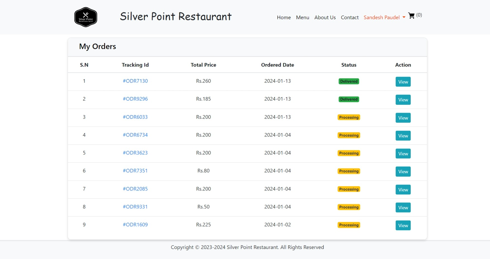

**Admin-Dashboard**
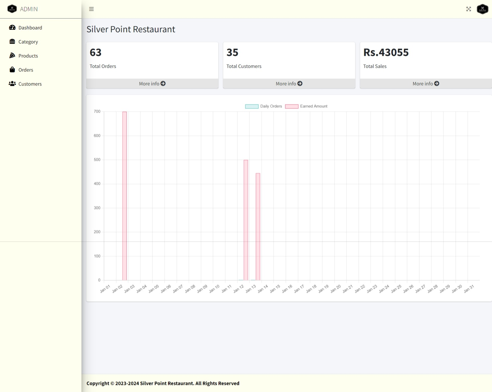

## Conclusion